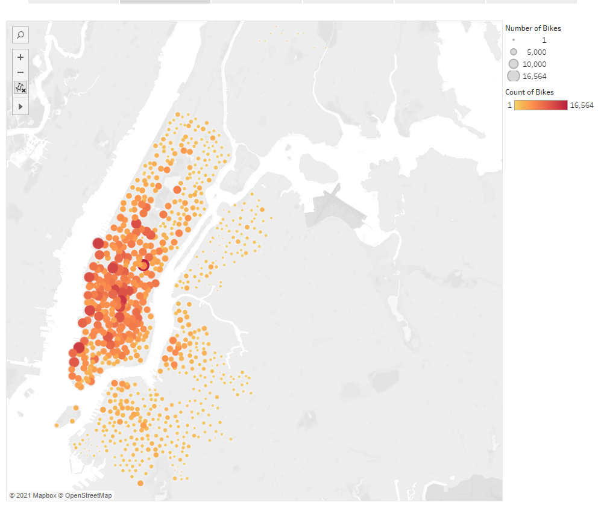

# NYC Citibike 

## Overview
In this module, I will work with Tableau to present a business proposal for a bike-sharing company. 
I will import, style, and portray the data accurately, then create worksheets, dashboards, and stories to visualize key data from a New York Citi Bike dataset.
I will also present my findings.

## Results

### Overview Distribution

### Map

### Checkout Time

### Trips by Weekday

### Trips by Weekday by Gender

###  User Trips by Usertype by Gender by Weekday

## Summary
 - Males use the bikes much more frequently than Females
 - 

## My Link
[linkToDashboard](https://public.tableau.com/profile/wenzhi.dong#!/)
